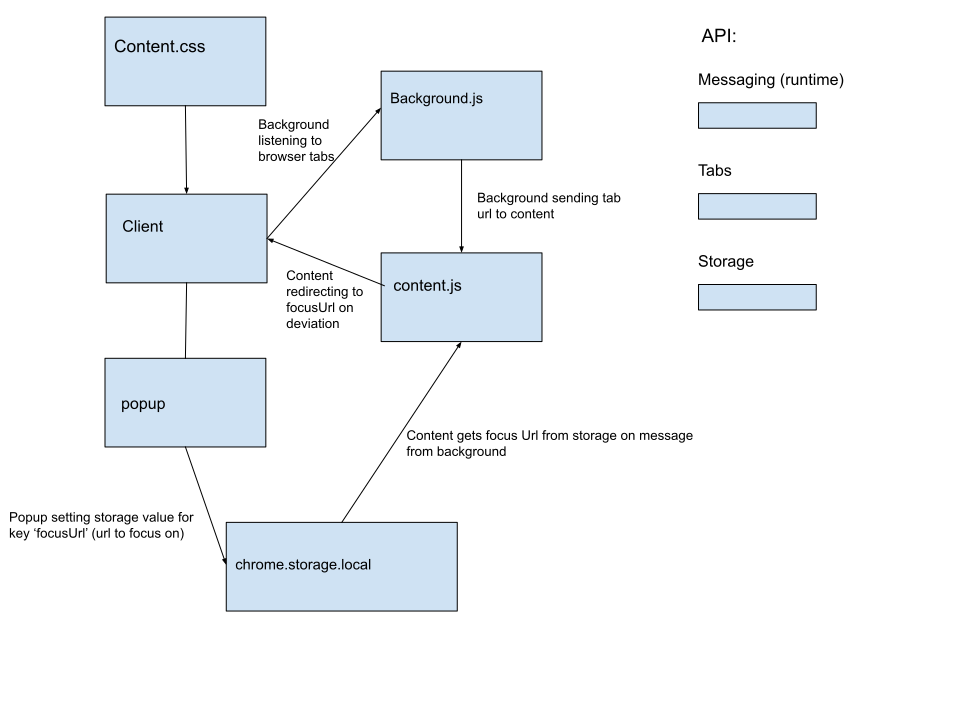

# Site-blocker

<!-- # Components -->
<!--  -->

# Installation

```
// clone repositiory
git clone https://github.com/tzrtg/site-blocker
// in chrome, navigate to extensions (chrome://extensions/)
// click load unpacked and select site-blocker
// from pop up, go to options and specify sites (format: "mail.google.com,coinbase.com,youtube.com,twitter.com")
```

# Add more sites to block

add the url permissions to the manifest.json

```
...
  "content_scripts": [
    {
      "js": ["content.js"],
      "css": ["content.css"],
      "matches": [
        "https://*.youtube.com/*",
        ...
      ]
    }
  ],
...

  "permissions": [
    "tabs",
    "https://*.youtube.com/*",
    ....

    "storage"
  ],
```

### Bug report / issues
* app crash - unresolved

tzrtg@protonmail.com
