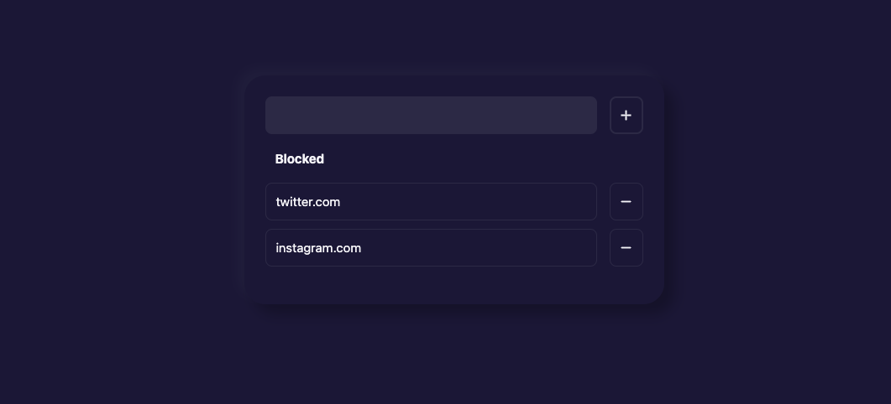

# Site-blocker
Block sites you wish to stop going to

<!-- # Components -->


# Installation

```
1. git clone https://github.com/tzrtg/site-blocker
2. in chrome, navigate to extensions (chrome://extensions/)
3. click load unpacked and select site-blocker directory
4. from pop up, go to options add sites to block
```

### Bug report / issues
* app crash - unresolved

